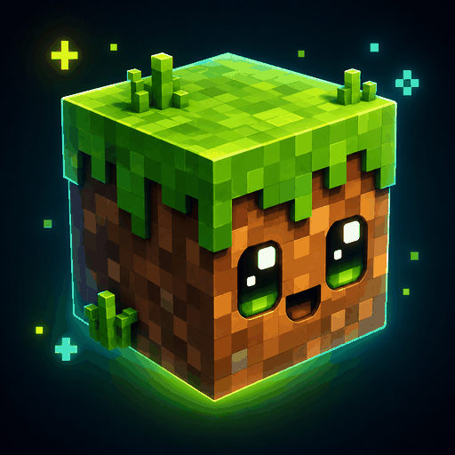

  

# QoL Mejoras de Calidad de Vida para Minecraft

<small><a href="README.md"> Read in English</a></small>

Mejoras pequeñas y prácticas para el día a día en Minecraft — **Forge**, **Fabric** y **NeoForge**.

**Este es mi tercer mod de Minecraft, creado por [alanjmrt94](https://github.com/alanjmrt94).**  
**Versión actual:** `1.20.1-0.6.0-alpha.1` (**alpha**) · Minecraft **1.20.1** · Cliente y servidor dedicado  

> Notas de versión: [changelog.txt](changelog.txt) (**siempre en inglés**) · notas anteriores aún listadas: `1.20.1-0.5.2` / `1.20.1-0.4.1`  
> El alpha de tiendas sale en **1.20.1** (Forge / Fabric / NeoForge). Los ports **1.21.1** (Forge / Fabric / NeoForge) y **26.1 / 26.2** (Fabric + NeoForge) ya compilan en el árbol como módulos sin publicar (aún no en Modrinth/CurseForge).

---

## ¿Qué es?

**Quality of Life for Minecraft** añade comodidades configurables para que supervivencia y creativo se sientan más fluidos — sin convertirse en un pack enorme.

Todo se configura desde un **menú in-game** (Mods → Config / Mod Menu, o la **Tableta de config QoL** en creativo). Al pasar el mouse por cada opción aparece un tooltip.

Los párrafos debajo de **Ver detalles** son opcionales: números de balance, claves de config y reglas finas.

## Funciones (v0.6.0-alpha)

### Tinte de agua de paisaje

- **Bidón de tinta de agua** — Bidón que pinta lagos y océanos con un overlay de color persistente (el agua sigue siendo vanilla).
  

  
Ver detalles

  **Crafteo:** lingotes de hierro + cristal + cubo vacío.  
  **Carga:** primero agua (cubo vanilla/sucio, botella, caldero, o clic en océano/río), después **un solo** color de tinte — rosa, lima, verde, cyan, púrpura, magenta o rojo — hasta **64** cargas (sin mezclar colores).  
  **Cargar tinte:** en el bloque colocado, con ambas manos (agua + tinte), o clic derecho con el tinte sobre el ítem en el inventario. A **64** se **sella** (no más tinte; no se vacía con Shift).  
  **Pintar:** clic derecho sobre agua con el bidón listo en la mano, o mano vacía sobre un bidón colocado listo. **Shift + mano vacía** quita una mancha cercana.  
  **Radio:** disco circular, lineal **2** (1 tinte) → **16** (64 tintes); vertical ±8. Persiste en datos del mundo (máx. **256** manchas/dimensión). Se rompe a mano (~1 s).  
  Config: `water_landscape_dye`.

  

### Sueño y descanso

- **Curar al despertar** — Al salir de una cama recuperás corazones.
  

  
Ver detalles

  Por defecto **1 corazón / 2 HP**; `0` lo apaga.

  

- **Bonus fogata** — Fogata encendida cerca suma corazones extra al despertar.
  

  
Ver detalles

  Default **+1 corazón** (**2 HP** sin fogata → **4 HP** con). Config: `campfire_sleep_bonus_hearts`.

  

- **Fogata y lluvia** — La fogata lit puede apagarse con lluvia o tormenta; un techo la protege.
  

  
Ver detalles

  **25%** lluvia / **80%** tormenta. Techo con **2 bloques de aire** entre fogata y techo → **0%** lluvia / **10%** tormenta. Incluye fogata de almas. Config: `campfire_rain_extinguish`.

  

### Antorchas

- **Antorchas húmedas** — El agua y el clima pueden apagarlas; se secan y pueden reencenderse solas o con flint and steel.
  

  
Ver detalles

  **Agua** en el bloque → **húmeda** (100%). Al exterior: **viento 10%** / **nieve 20%** / **nieve+lluvia 50%** → **apagada** (bioma frío: **20%** → húmeda). Solo lluvia no apaga. Secado ~**2 min** (más rápido cerca de fogata lit, radio 12); reencendido ~**2 min** (o flint and steel). Arena/grava encima → drop **apagada**. Ítems en agua/lluvia se humedecen. Config: `wet_torches`, `torch_dry_ticks`.

  

### Supervivencia / movimiento

- **Hambre por movimiento** — Saltar o correr gasta un poco más de hambre.
  

  
Ver detalles

  **+5%** al saltar o correr; **+10%** si hacés ambos a la vez. Config: `movement_hunger`.

  

### Calderos y agua

- **Caldero tintable** — Teñís el agua y usás el color en lana, camas, concreto y cuero.
  

  
Ver detalles

  Intensidad **1–3** (tinta negra incluida). Teñís lana, camas, concreto/polvo y **todo el cuero** (casco, pechera, pantalones, botas). El concreto vacía agua (intensidad 1 dura menos). Niveles 1–3 visibles. Un **cubo de agua** sube a nivel 3 y **diluye** la intensidad de a poco (no borra el color de golpe).

  

- **Botellas de agua coloreada** — Embotellás el agua teñida, la volcás de nuevo o las colocás en grupo.
  

  
Ver detalles

  Ítem `colored_water_bottle` (aspecto de poción). Beber: −½ corazón y 20% efecto random. Con glow, **brilla**. **Shift+clic** coloca hasta **32** botellas por bloque (vainilla + QoL).

  

- **Agua sucia** — Sacás el tinte en un cubo, lo vaciás o lo embotellás.
  

  
Ver detalles

  Cubo vacío + caldero teñido → cubo sucio (sin glint). Vaciar → cubo vacío / charco turbio. Botella sucia: veneno 2s, −hambre, 45% efecto random; compostador ~50%. Ver [Acciones especiales](#acciones-especiales).

  

- **Tinta luminosa (glow)** — El agua brilla un poco sin perder el color.
  

  
Ver detalles

  Luz vanilla monocroma + partículas del color. Glow aclara sin opacar el tinte (nivel 3 sigue intenso). Camas/lana/cuero/botellas con glow muestran glint (mixins).

  

- **Lluvia más rápida** — Los calderos se llenan más rápido con lluvia y tormenta.

- **Agua dulce / salada** — Embotellar en océano o en río/caldero no es lo mismo.
  

  
Ver detalles

  Océano = salada (náuseas). Río/caldero = dulce (bebible). Tooltips y tinte distintos.

  

- **Destilación simple** — Caldero con agua sobre fuego: sacás sal o agua dulce a mano.
  

  
Ver detalles

  Mano vacía → sal; sneak + botella → agua dulce.

  

- **Destilador** — Alambique con combustible: agua salada → dulce + sal (también sin botellas si hay calderos vecinos).
  

  
Ver detalles

  GUI: combustible, salada arriba, 3 botellas vacías → dulce + sal. Overlays de progreso (heater, líquido, tubos). Receta: cobre + vidrio + hierro + botella. Sneak → manual. Combustibles `#qolminecraft:distiller_fuels` (antorcha ≈½ carbón, blaze ≈3, palo ×2, lava ×3 horno). Lava deja **cubo de piedra fundida** (vaciar: piedra o mena rara). Antorcha/blaze también en horno/alto horno. Adyacente: océano/caldero salado → caldero dulce + sal (con fuel).

  

- **Sal y sazonado** — Condimentás comida con sal o azúcar; craft de bloque de sal.
  

  
Ver detalles

  NBT `qol_seasoning=salt|sugar` + tags. Sal +25% hambre; azúcar cura + Speed. Overlay/glint. Patata/pan sazonados legacy siguen. Bloque de sal = 9 sal.

  

- **Esponja en caldero teñido** — Saca tinte/glow sin vaciar el agua.

- **Caldero de lava** — Da luz y quema a quien esté adentro.
  

  
Ver detalles

  Luz default **15** (configurable). Daño on/off por config.

  

- **Caldero de nieve / helados** — Congela, se llena con nieve y sirve para hacer helado.
  

  
Ver detalles

  Congela según nivel (config). **Bloque de nieve** = lleno; **bolas** suman hasta 3 niveles. Helado: leche + azúcar + tinte → sabor; **cucurucho** (papel+azúcar) saca scoop (tipo galleta, freeze ~2 s).

  

- **Entrar al caldero** — Agua/teñido moja; algunos mobs se comportan distinto.
  

  
Ver detalles

  Config `cauldron_enter_effects` / `cauldron_water_wets`. Pollos quedan atrapados; loros flotan.

  

- **Señal de comparador** — El caldero reporta qué tiene adentro.
  

  
Ver detalles

  Vacío 0 · agua/teñida/nieve 1–3 · lava 3 · teñida + pez nivel+1 (máx. 4).

  

- **Peces en caldero** — Guardás tropical o globo; el globo envenena.
  

  
Ver detalles

  Burbujas en agua/teñido. **Shift + mano vacía** para sacar. Globo envenena al sacar o al estar dentro.

  

- **Cocinar en caldero** — Con calor debajo, cocinás comida cruda (o el pez guardado).
  

  
Ver detalles

  Calor: fuego, fogata lit, lava, magma… Gasta **1 nivel** de agua. Pez + mano vacía + calor → cocina el pez.

  

- **Patatas sucias y lodo** — A veces cosechás patata sucia; lavarla ensucia el agua y termina en lodo.
  

  
Ver detalles

  - Cosecha madura: chance default **5%** (`dirty_potato_chance`) de patata sucia.
  - Comer: menos saturación; chance de hambre breve.
  - Lavar en caldero con agua → patata limpia; el agua se pone marrón intensidad 1→2→3.
  - Al llegar a 3: **lodo húmedo** + caldero fangoso (embotellable). Lavados extra bajan el nivel.
  - Lodo húmedo / botella: compostador ~50%; horno → `minecraft:mud`; colocar → tierra (hueco) o charco de lodo (patina; no se va con lluvia).
  - Lodo vainilla extendido: patina + lento; parado te hundís ~⅓ (más con lluvia/tormenta).
  - Clima: lluvia puede pasar tierra→lodo; sol seca lodo→tierra (fuera de pantano/manglar). Config: `mud_world_effects`.

  

### Comida y bebidas

- **Comida que se pudre** — La comida cocida envejece si no la guardás bien.
  

  
Ver detalles

  Fresco → rancio → carne podrida (ticks configurables; se puede apagar). Tooltip con tiempo. Tag `#qolminecraft:never_spoils`. Sazonada se pudre más lento.

  

- **Heladera** — Baja la pudrición; puerta animada, interior hueco y un estante de plástico.
  

  
Ver detalles

  Mate/porosa (no combinable). Plancha aislante + nieve; spoilage ×0.25. Sonidos suaves tipo telgopor; GUI de inventario alineada al cofre vanilla; estantes con ítems. El interior no se ilumina de más.

  

- **Heladera reforzada** — Versión de hierro; se combina en vertical, Side by Side o con freezer.
  

  
Ver detalles

  Upgrade con hierro o craft desde cero. **2 vertical** = 54 slots; **2×2 Side by Side** con puertas francesas (un solo cuerpo, estantes de vidrio, slot de redstone para luz interior abierta); **1 + freezer**. Spoilage ×0.15. Sonidos de puerta/trampilla de hierro (un solo play al abrir/cerrar). GUI ancha con inventario del jugador centrado.

  

- **Freezer** — Congela spoilage con nieve; dos juntos forman tapa doble e interior nevado.
  

  
Ver detalles

  8 comida + 8 nieve (**16 bolas** por slot hermano). Acepta **polvo o bloque de redstone** para la ráfaga (también sirve señal de vecinos). Al abrir un double freezer con nieve: partículas, overlay frío suave; daño de freeze solo tras **~10 s** con GUI abierta y nieve cargada. Revestimiento translúcido de nieve. GUIs (simple, doble, combo) alinean el inventario como un cofre vanilla.

  

- **Naranjas y jugo** — Jugo más fuerte que la fruta; las hojas de acacia pueden dropear naranjas.
  

  
Ver detalles

  Quita veneno, resistencia breve, **−10%** daño de drowned. Prensa: naranja + botella en manivela+tolva. Se puede volcar a frasco. Visual opcional en árboles: `tree_fruit_visuals` (default off; naranjas también `orange_enabled`).

  

#### Manivela (molino)

- **Manivela + tolva** — Mantené clic para moler; los productos salen al cofre.
  

  
Ver detalles

  Colocá la manivela **arriba** o en un **costado** de la tolva. La boquilla solo aparece acoplada; se mantiene la primera conexión. Insumos sin moler se retienen; productos van al cofre. Al romper: vacía al cofre (**25%** de derrame). Progreso en action bar, sonido grindstone, pulso redstone 2–4 ticks. Recetas (toggles): café, cacao, trigo→harina, hueso→harina de hueso, cobble→gravel, naranja+botella. También `coffee_grind_turns`.

  

#### Café

- **Cultivo y bebidas de café** — Arbusto, vasos de papel y compat blanda con Coffee Delight.
  

  
Ver detalles

  Arbusto sobre **arena**; bayas silvestres en biomas cálidos (si hay Coffee Delight, en Fabric no duplica worldgen). Bayas → granos → molido (también tinte marrón). **Pegamento de slime** + **vaso de papel**. Café en cuenco o vaso (−10% hambre, stamina, Speed largo). Café con leche (−20% hambre, +1 HP, quita veneno). Servir/beber desde frasco. Calentar 3 min en fuego/fogata/magma/lava. Azúcar potencia efectos. Soft-compat CD: tags, conversiones 1:1, asado, craft de café negro CD, cutting board.

  

#### Chocolate

- **Cadena de chocolate** — Del cacao al chocolate caliente y la chocolatada.
  

  
Ver detalles

  Cacao molido → manteca → barra. Chocolate caliente / chocolatada (~2 HP). Caliente: protección al frío 3 min. Mismas reglas de calor/azúcar que el café. No quita veneno.

  

#### Frascos

- **Frasco de vidrio** — Guardás varios líquidos y podés colocarlo para servir.
  

  
Ver detalles

  Hasta **4 porciones**. Llenar desde la otra mano (leche, café, chocolate, agua, jugo, cacao…). Beber leche limpia efectos. Shift+uso vacía. Shift+clic coloca frasco; cuenco vacío sirve. Config: `jars_enabled`.

  

### Animales

- **Animales duermen** — Algunos mobs duermen de día o de noche con partículas zzz.
  

  
Ver detalles

  Tags `#qolminecraft:diurnal_sleepers` / `nocturnal_sleepers`. Despiertan con daño, lluvia o jugador cerca. Config de chance y radio.

  

### Inventario y construcción

- **Slots pineados** — Tecla **P**: fijás el hotbar para no tirarlo ni moverlo sin querer.
  

  
Ver detalles

  Tirar pide doble confirmación. Quick-move no mueve pineados. Icono en GUIs. Persisten en NBT del jugador.

  

- **Ghost block** — Vista previa del bloque antes de colocarlo.
  

  
Ver detalles

  Respeta orientación de slabs/stairs. Tecla **G**. **Apagado por defecto**.

  

### Escritura

- **Lápiz, lapicera y anotador** — Anotá día, nick, coords y bioma sin perder el libro al morir.
  

  
Ver detalles

  Lápiz: palos+flint. Lapicera: palos+tinta+`#qolminecraft:iron_nuggets` (+50% durabilidad; recarga con tinta). Anotador: libro + herramienta. Shift+uso o botones en la UI del libro. Gasta durabilidad al insertar.

  

### Otros

- **Config in-game** — Menú con tooltips; también `config/qolminecraft-common.toml`.
  

  
Ver detalles

  Tableta creativa QoL. Analytics local/online (online con licencia). Samples de bloque/loot. Dev: `debug.creative_tab = true` → pestaña **QoL Debug** (reinicio).

  

### Bedrock vs QoL (calderos)

Java + este mod **no** copian 1:1 los calderos de Bedrock. QoL tiene sus reglas; paridad Bedrock (pociones, tipar flechas, etc.) queda para más adelante **opt-in**.

Ver tabla de diferencias

| Tema | Bedrock (típico) | QoL (este mod) |
|------|------------------|----------------|
| Mezcla de tintes | Pueden mezclarse (estilo RGB) | Un color a la vez; otro tinte → intensidad 1 del nuevo color |
| “Fuerza” del color | Sobre todo teñido sí/no | Intensidad **1–3** + **glow** opcional |
| Botella / cubo al sacar | Suele ser agua normal / cubo vacío | **Botella coloreada**; cubo sucio conserva tinte |
| Añadir agua | A menudo destiñe de golpe | Diluye de a poco |
| Cuero / lana / camas / concreto | Enfoque en cuero | Set completo de cuero + lana/camas/concreto |
| Pociones en el caldero | Llenar / tipar flechas / etc. | **No** — no es brewing stand |
| Tipar flechas | Sí en Bedrock | **No** en esta versión |
| Solo QoL | — | Destilador, dulce/salada, lodo, peces, cocinar, entrar, nieve, helados, lava |

No hay bloque “Legacy brewing” ni árbol completo de pociones en el caldero.

### Acciones especiales

Combinaciones de ítems (manos o inventario) que no son crafteos de mesa.

Ver tablas de acciones

#### Ítems en cada mano

Mano principal + secundaria (`F`). Clic derecho en el aire o en un bloque que no consuma el uso:

| Mano A | Mano B | Resultado |
|--------|--------|-----------|
| Botella de vidrio vacía | Cubo de agua sucia | 1 botella sucia; cubo vacío |
| Azúcar | Cuenco/vaso café / leche / chocolate | Endulza (potencia + Speed extra) |
| Cubo/jar de leche | Cuenco/vaso de café | Café con leche |
| Cubo/jar de leche | Chocolate caliente | Chocolatada |
| Frasco vacío | Leche / bebida / botella / jugo / cacao | Llena el frasco (+1 porción) |
| Frasco con leche (uso) | — | Beber leche (−1 porción) |
| Frasco con café (uso) | — | Beber café (−1 porción) |
| Frasco lleno (Shift+uso en bloque) | — | Coloca frasco colocado |
| Cuenco/vaso vacío | Frasco (mano o colocado) con café | Sirve café |
| Cuenco/vaso café o chocolate caliente | Frasco colocado con leche | Café con leche / chocolatada |
| Fuente de agua (cubo/botella) | Tinte permitido | Llena bidón en mano/colocado (agua y luego pigmento) |
| Bidón listo (uso sobre agua) | — | Pinta mancha circular; radio según cargas |
| Mano vacía sobre bidón colocado listo | — | Misma pintura |
| Shift + mano vacía en bidón / cerca de mancha | — | Vacía el bidón (si no está sellado) o quita mancha cercana |

#### Inventario (cursor)

| Acción | Resultado |
|--------|-----------|
| Botella vacía en el **cursor** + clic derecho sobre cubo sucio | Botella sucia; slot con cubo vacío |
| Cubo sucio en el **cursor** + clic derecho sobre botella(s) vacías | Llena 1 botella y vacía el cubo |
| Tinte permitido en el **cursor** + clic derecho sobre Bidón de tinta | +1 pigmento (mismo color; necesita agua; tope 64) |

## Cómo configurar

1. **In-game:** Opciones → Mods → **Quality of Life for Minecraft** → Config  
   - Fabric: **Mod Menu** si lo tenés  
   - O la **Tableta de config QoL** en creativo  
2. **Archivo:** `config/qolminecraft-common.toml`  
3. **Guardar y aplicar** en la UI para recargar al instante  

## Compatibilidad

| | |
|---|---|
| Minecraft | **1.20.1** (alpha en tiendas) · **1.21.1** sin publicar · **26.1 / 26.2** sin publicar |
| Loaders | **1.20.1 / 1.21.1:** Forge · Fabric · NeoForge · **26.x:** solo Fabric · NeoForge |
| Java | **17+** en 1.20.1 · **21+** en 1.21.1 · **25+** en 26.x |
| Lados | Cliente y/o servidor dedicado |

Descargá el JAR de tu loader (`*-forge`, `*-fabric` o `*-neoforge`). No mezcles loaders.

## Licencia

Ver [LICENSE.md](LICENSE.md).

- Uso en cliente/servidor con crédito a **alanjmrt94**
- Redistribución **sin modificar** (p. ej. modpacks) OK con licencia + crédito
- **Sin modificaciones ni derivados**
- **Sin venta comercial**

## Enlaces

- Docs y changelog: [github.com/alanjmrt94/QoL-minecraft-public](https://github.com/alanjmrt94/QoL-minecraft-public)
- Discord: [discord.gg/CcUNTJjPD](https://discord.gg/CcUNTJjPD)
- Modrinth: [modrinth.com/mod/quality-of-life-minecraft](https://modrinth.com/mod/quality-of-life-minecraft)
- CurseForge: [curseforge.com/.../quality-of-life-for-minecraft](https://www.curseforge.com/minecraft/mc-mods/quality-of-life-for-minecraft)
- Changelog: [changelog.txt](changelog.txt)

El código de desarrollo es un **proyecto privado cerrado** ([QoL-minecraft](https://github.com/alanjmrt94/QoL-minecraft)). El README y las notas de versión públicas viven en [QoL-minecraft-public](https://github.com/alanjmrt94/QoL-minecraft-public).
